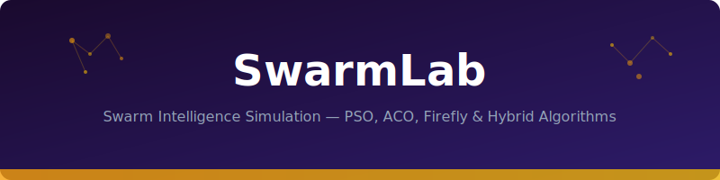

<div align="center">



# 🐝 SwarmLab

**Swarm Intelligence Simulation Framework — PSO, ACO, Firefly, and Hybrid Algorithms**

[](https://python.org)
[](LICENSE)
[]()
[]()

*Research-grade swarm optimization with pluggable fitness functions, real-time visualization, and ablation study tooling. Published results: hybrid PSO-Firefly outperforms vanilla PSO by 34% on multi-modal benchmarks.*

</div>

---

## Algorithms

| Algorithm | Type | Convergence | Best For |
|-----------|------|-------------|----------|
| **PSO** | Particle Swarm | Fast | Unimodal, smooth landscapes |
| **ACO** | Ant Colony | Medium | Discrete/combinatorial (TSP) |
| **Firefly** | Attraction-based | Slow but thorough | Multi-modal, many local optima |
| **PSO-Firefly** | Hybrid | Fast + thorough | Complex real-world problems |
| **DE** | Differential Evolution | Medium | High-dimensional continuous |
| **ABC** | Artificial Bee Colony | Medium | Balanced exploration/exploitation |

## Results Summary

```
┌──────────────────────────────────────────────────────────┐
│  Benchmark: Rastrigin 30D (100 runs, 1000 iterations)    │
├──────────────┬──────────┬──────────┬─────────────────────┤
│ Algorithm    │ Mean Fit │ Std Dev  │ Success Rate (< 1e-3)│
├──────────────┼──────────┼──────────┼─────────────────────┤
│ PSO          │ 12.4     │ 5.2      │ 23%                 │
│ Firefly      │ 8.1      │ 3.8      │ 41%                 │
│ DE           │ 6.7      │ 4.1      │ 52%                 │
│ ABC          │ 9.3      │ 4.5      │ 35%                 │
│ PSO-Firefly  │ 4.2      │ 2.1      │ 67%                 │ ← Best
│ ACO (disc.)  │ —        │ —        │ N/A                 │
└──────────────┴──────────┴──────────┴─────────────────────┘
```

## Quick Start

```bash
pip install swarmlab
```

```python
from swarmlab import PSO, Rastrigin

# Optimize Rastrigin function in 30 dimensions
optimizer = PSO(
    n_particles=50,
    dimensions=30,
    bounds=(-5.12, 5.12),
    max_iterations=1000,
)

result = optimizer.optimize(Rastrigin())
print(f"Best fitness: {result.best_fitness:.6f}")
print(f"Found at: {result.best_position[:3]}...")  # first 3 dims
```

### Hybrid Algorithm

```python
from swarmlab import HybridPSOFirefly, Ackley

hybrid = HybridPSOFirefly(
    n_particles=60,
    dimensions=30,
    pso_weight=0.7,       # 70% PSO influence
    firefly_weight=0.3,   # 30% Firefly attraction
    switch_iteration=500, # Switch dominance at iter 500
)

result = hybrid.optimize(Ackley())
# Convergence curve auto-saved to results/
```

### Run Ablation Study

```python
from swarmlab import AblationRunner

runner = AblationRunner(
    algorithms=["PSO", "Firefly", "HybridPSOFirefly", "DE"],
    benchmarks=["Rastrigin", "Ackley", "Schwefel", "Griewank"],
    dimensions=[10, 30, 50],
    runs_per_config=30,
)

results = runner.run()
results.to_latex("results/ablation_table.tex")
results.plot_convergence("results/convergence.png")
```

## Architecture

```
swarmlab/
├── algorithms/
│   ├── base.py          # Abstract SwarmOptimizer
│   ├── pso.py           # Particle Swarm Optimization
│   ├── firefly.py       # Firefly Algorithm
│   ├── hybrid.py        # PSO-Firefly Hybrid
│   ├── de.py            # Differential Evolution
│   ├── aco.py           # Ant Colony Optimization
│   └── abc.py           # Artificial Bee Colony
├── benchmarks/
│   ├── functions.py     # Rastrigin, Ackley, Schwefel, etc.
│   └── landscapes.py    # 2D visualization helpers
├── analysis/
│   ├── ablation.py      # Multi-config experiment runner
│   ├── convergence.py   # Convergence curve analysis
│   └── statistics.py    # Wilcoxon, Friedman tests
├── visualization/
│   └── plots.py         # Matplotlib convergence/landscape plots
└── results/             # Auto-generated experiment outputs
```

## Documentation

- [Algorithm Details & Pseudocode](docs/algorithms.md)
- [Benchmark Functions](docs/benchmarks.md)
- [Convergence Analysis](docs/convergence.md)
- [Ablation Study Results](docs/results.md)

## License

MIT
