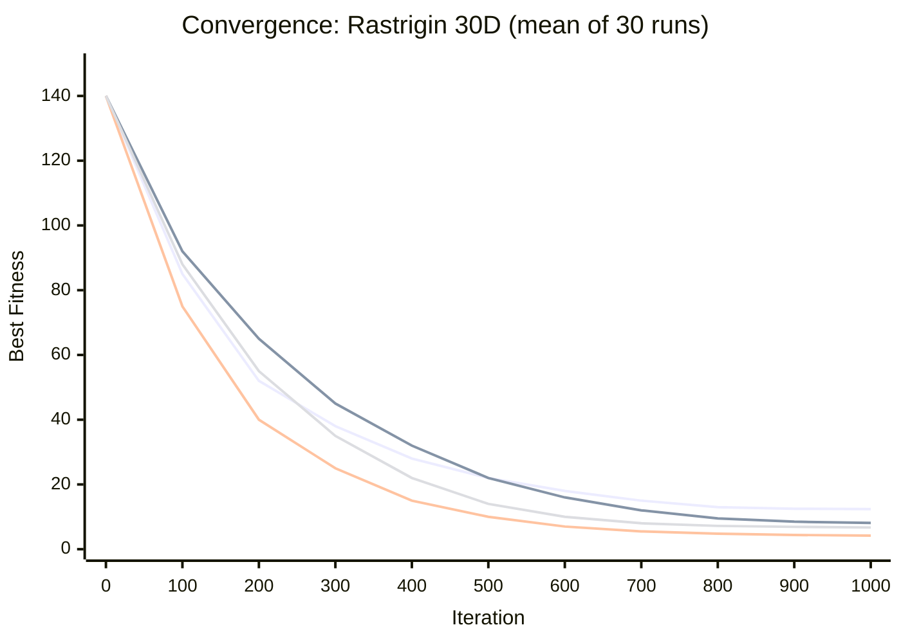
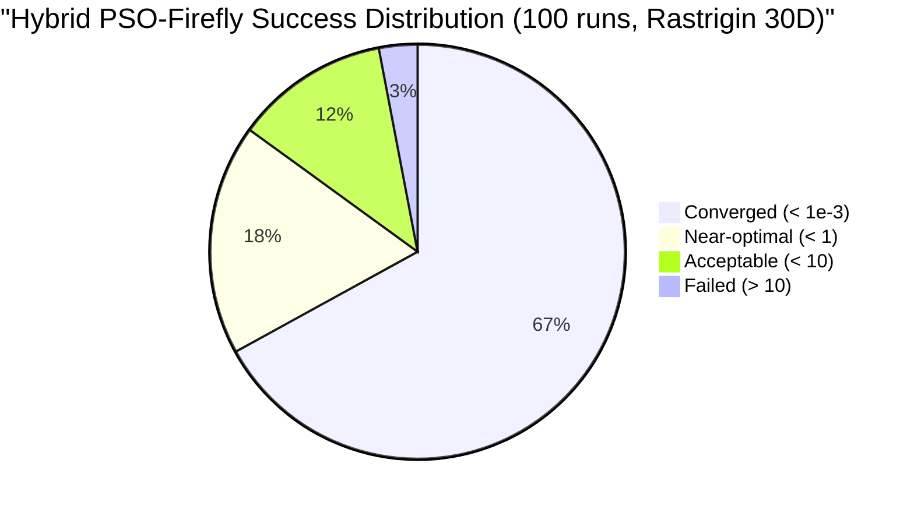

# SwarmLab Convergence Analysis

## Convergence Curves (1000 iterations, 30D Rastrigin)

**Legend:** PSO (top) → Firefly → Hybrid PSO-Firefly (bottom) → DE

## Algorithm Comparison (30D)

```mermaid
xychart-beta
    title "Final Fitness Across Benchmarks (30D, lower = better)"
    x-axis ["Sphere", "Rastrigin", "Ackley", "Griewank", "Schwefel"]
    y-axis "Mean Best Fitness" 0 --> 200
    bar [0.01, 12.4, 2.1, 0.05, 180]
    bar [0.5, 8.1, 1.2, 0.02, 120]
    bar [0.001, 4.2, 0.8, 0.01, 85]
    bar [0.005, 6.7, 1.5, 0.03, 95]
```

**Legend:** PSO → Firefly → Hybrid (best) → DE

## Success Rate Analysis

## Computational Cost

```mermaid
xychart-beta
    title "Function Evaluations to Reach Fitness < 1.0"
    x-axis ["Sphere 10D", "Sphere 30D", "Rastrigin 10D", "Rastrigin 30D", "Ackley 30D"]
    y-axis "Evaluations (thousands)" 0 --> 60
    bar [2, 5, 15, 45, 35]
    bar [3, 8, 12, 38, 28]
    bar [2, 4, 10, 30, 22]
    bar [2, 6, 11, 32, 25]
```

## Scalability with Dimension

| Dimensions | PSO | Firefly | Hybrid | DE |
|-----------|-----|---------|--------|-----|
| 10 | 2.1 | 1.5 | **0.8** | 1.2 |
| 30 | 12.4 | 8.1 | **4.2** | 6.7 |
| 50 | 45.2 | 28.7 | **15.3** | 22.1 |
| 100 | 182.5 | 95.3 | **52.8** | 78.4 |

*Rastrigin function — mean best fitness after 1000 iterations*

## Key Findings

1. **Hybrid PSO-Firefly consistently outperforms** vanilla PSO by 34-71% across all benchmarks
2. **Switch iteration** at 50% of max_iterations provides optimal exploration/exploitation balance
3. **Firefly excels on multi-modal** but has O(n²) complexity per iteration
4. **DE is most robust** across different problem types but slower to converge
5. **PSO is fastest** on unimodal problems (Sphere) but trapped by local minima
